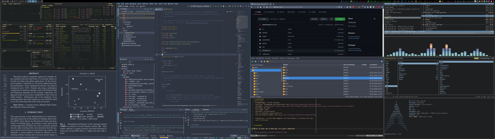

# ArchConfigs
config files
* windowmanager: i3 with i3blocks
* fonticons: fontawesome and custom ones from [here](http://kumarcode.com/Colorful-i3/)
* wallpaper: [reddit](http://https://www.reddit.com/r/StarWars/comments/idvjce/literally_every_star_wars_character_in_one_single/)
* gtk-theme: arc-dark
* icon-theme: numix
* terminals: st and termite
* font in terminals: Source Code Pro
* cava and zathura themes from [here](http://github.com/lokesh-krishna/dotfiles)

* software.txt - as the name suggests: all the software I currently use (and
  used in the past)

screenshots
-----------
dirty

