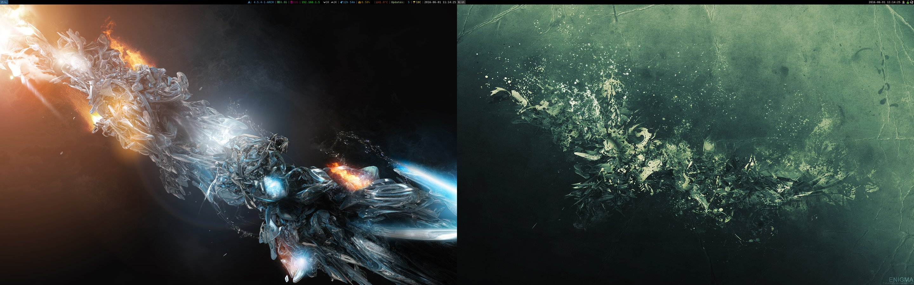

# ArchConfigs
config files
* windowmanager: i3 /w i3blocks
* fonticons: fontawesome and custom ones from http://kumarcode.com/Colorful-i3/
* wallpaper: http://futurology.deviantart.com/
* gtk-theme: arc-dark
* icon-theme: numix
* terminals: urxvt and termite

screenshots
-----------

clean

dirty

